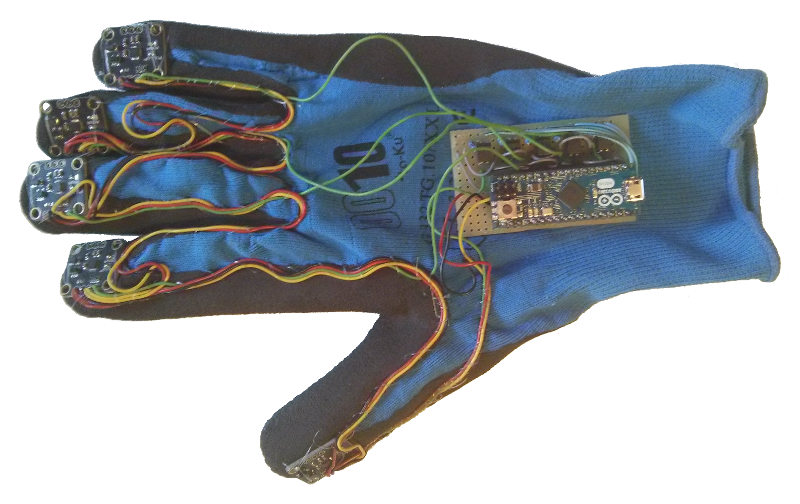

# Glove Acquisition Package
This package provides a ROS node to retrieve data from the *5 IMUs Glove*, which it is shown in the figure below. The Arduino Micro on the Glove reads new samples from the sensors and sends the gathered data through the serial communication (check the port on which the glove is connected).

Each line of data from the Glove has the follow pattern: [*x1;y1;z1;x2;...;z5*], where each field is a six-digit integer by default (have a look to the Arduino Sketch to understand how data is sent over the serial stream). If both accelerometers and gyroscopes are enabled, two distinct same-format lines are sent on the stream each time.

The ROS publisher node, i.e. *glove_talker*, publishes data on a topic (by default *glove_topic*) using `glove_acquisition::GloveIMUArray` messages, which can collect both linear accelerations and angular velocities. This data can be stored in log files if necessary, e.g. using a node like the *glove_listener*.

## Usage
The publisher and the listener nodes can be started with `rosrun` command and few ROS params can be set to fit your needs: 

 - `rosrun glove_acquisition glove_talker`
 - `rosrun glove_acquisition glove_talker _serial_port:=/dev/ttyACM0`
 - `rosrun glove_acquisition glove_listener`
 - `rosrun glove_acquisition glove_listener _verbose_mode:=true`

Otherwise a launch file can be set with the actual configuration of the glove. Two launch files with default settings are provided in the package, e.g. to start only the publisher node you can use `roslaunch glove_acquisition glove_publisher.launch` and to store also the data acquired in log files use `roslaunch glove_acquisition glove.launch`. Feel free to build others that fit your hardware configuration.

## Info and Warnings

- The *GloveCore* class has been tested only for the *5 IMUs Glove*. Anyway, it provides several ROS params to choose the actual hardware configuration, e.g. different number of IMUs.
- The *GloveCore* class uses linux-specific commands, e.g. `system("mkdir -p ...")`. 
- This code has been developed for ROS Indigo on ubuntu 14.04. No warranty for other distributions.

## ROS Params
The class provides several parameters which can be set by the user at runtime to handle even distinct hardware configuration:

- topic_name *(pub/sub)*
- topic_queue_length *(pub/sub)*
- verbose_mode *(pub/sub)*
- num_imus *(pub)*
- num_digits *(pub)*
- serial_port *(pub)*
- start_comm_char *(pub)*
- log_file_base_path *(sub)*
- log_file_name_accelerometers *(sub)*
- log_file_name_gyroscopes *(sub)*
- log_multi_files *(sub)*
